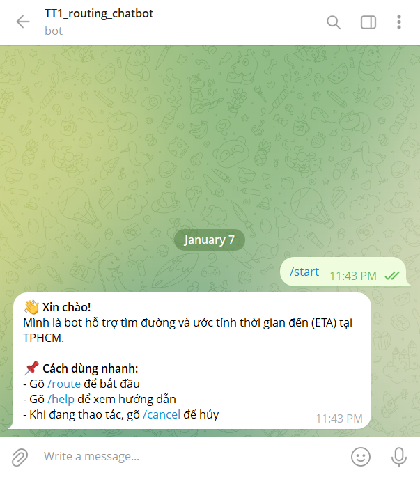
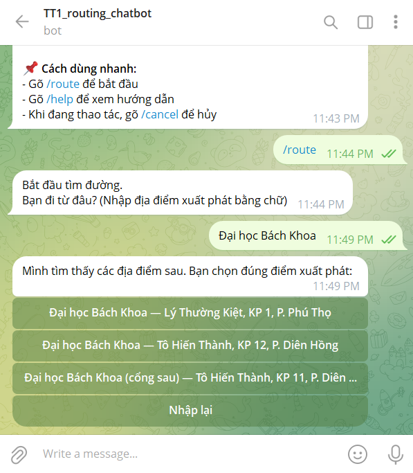
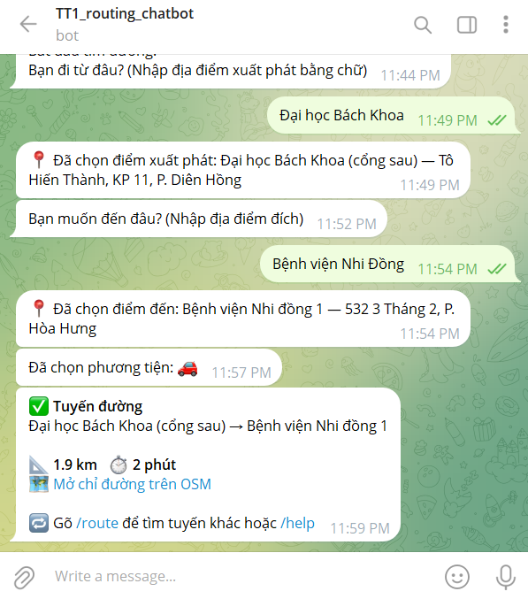
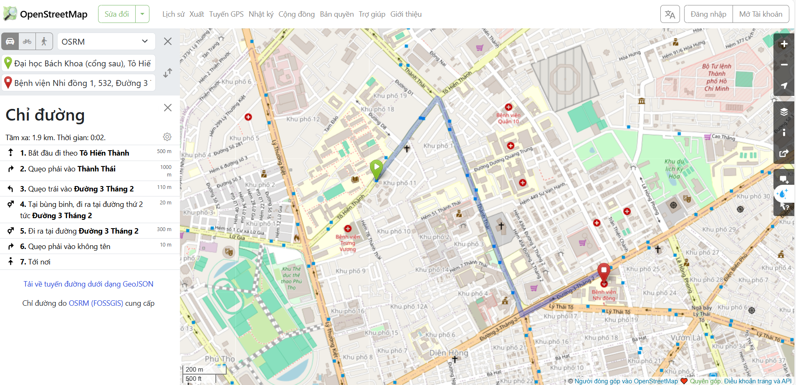

# TT1 – Route & ETA Chatbot (Telegram)

A Python-based Telegram chatbot that helps users **find routes and estimate travel time (ETA)** between two locations.

The system integrates **OpenStreetMap services** (Nominatim, OSRM) and uses a **Finite State Machine (FSM)** to manage a clear, step-by-step conversation flow.

---

## Project Context

- **Course**: Thực tập 1 (TT1) – Master Program, HCMUT  
- **Major**: Computer Science  
- **Type**: Individual academic project  
- **Focus**: Python backend, API integration, conversation flow design

This project emphasizes **system implementation and API orchestration**, rather than machine learning.

---

## System Architecture

<p align="center">
  
</p>

---

## Chatbot Demo

### 1. Start & command usage


### 2. Location disambiguation (top-3 candidates)


### 3. Route result & ETA


### 4. OpenStreetMap route visualization



---

## Key Features

- Step-by-step route collection using chat commands
- FSM-based conversation control
- Top-3 location candidates for ambiguous user input
- Distance and ETA calculation via OSRM
- OpenStreetMap direction link generation
- Graceful handling of invalid or cancelled requests

---

## How to Run

### 1. Install dependencies

```bash
pip install -r requirements.txt
```

### 2. Create environment configuration

Create a file named `.env` in the project root with the following content:

```env
TELEGRAM_BOT_TOKEN=your_bot_token_here
```

> **Note:** Do not commit the `.env` to GitHub. It is intentionally ignored.

### 3. Run the bot

```bash
python main.py
```

